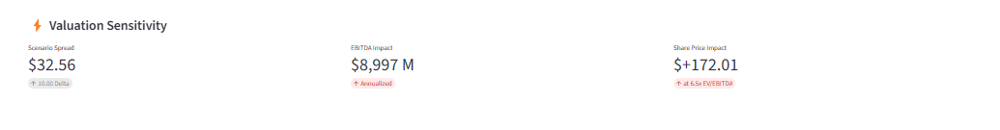

# 🛢️ Refinery Arbitrage Engine
**Real-Time Commodity Margin & Equity Valuation Monitor**

**[🚀 Launch Live Dashboard →](https://refinery-arbitrage-engine-uturqbhqngbykahhfonr6k.streamlit.app/)**

### 📊 Business Context
Refineries profit from the **"Crack Spread"**—the economic differential between crude oil input costs and refined product output prices (Gasoline & Diesel). This platform models the industry-standard **3:2:1 Crack Spread** to quantify the "Physical Reality" of the energy market and correlates it to downstream equity valuations.

**The "So What?" for Investors:**
When physical margins compress, refinery valuations contract. This engine answers: *If the crack spread drops by $5/bbl today, what is the implied EBITDA impact for Valero (VLO)?*

---

### 🚀 Key Intelligence Modules

#### 1. The Physical Arbitrage Monitor (Engineering Layer)
* **Logic:** Implements the **3:2:1 Mass Balance** formula: `(2 * Gasoline + 1 * Distillate - 3 * Crude) / 3`.
* **Unit Operations:** Automatically handles unit conversion (Gallons $\to$ Barrels) and aligns Futures contract expirations.
* **Alpha:** Identifies "margin expansion" events in real-time before they appear in quarterly earnings reports.

#### 2. Valuation Sensitivity Model (Banking Layer)
* **Goal:** Quantify **Operational Leverage**.
* **Methodology:** A "DCF-Lite" engine that simulates EBITDA shocks based on spread volatility.
* **Scenario:** *User Input:* "What if margins crash to $15/bbl?" $\to$ *Output:* "VLO Share Price implied impact: -$12.45".

#### 3. Statistical Correlation Engine (Quant Layer)
* **Hypothesis:** Downstream equities are mathematically coupled to physical margins.
* **Proof:** Calculates **90-Day Rolling Correlations** to visualize "Regime Changes" (e.g., the 2020 COVID decoupling).
* **Metrics:** Real-time **R-Squared ($R^2$)**, **Z-Score**, and **Percentile Rank**.

---

### 🛠️ Technical Stack
* **Core Logic:** Python (Pandas, NumPy, SciPy)
* **Visualization:** Streamlit, Plotly Interactive (Dual-Axis Charts)
* **Statistics:** Statsmodels (OLS Regression), Rolling Window Analysis
* **Data Pipeline:** `yfinance` API (Real-time Futures: CL=F, RB=F, HO=F, NG=F)

---

### 💻 Local Installation
To run this engine on your local machine:

```bash
# 1. Clone the repository
git clone https://github.com/your-username/Refinery-Arbitrage-Engine.git

# 2. Install dependencies
pip install -r requirements.txt

# 3. Run the data pipeline (first time only)
python src/data_pipeline.py
python src/spread_calculator.py

# 4. Launch the dashboard
streamlit run app/streamlit_app.py
```

---

### 🔑 Key Findings

Based on 5 years of historical data (2020-2025):

- **Average Gross Margin:** $23.80/bbl (3:2:1 crack spread)
- **Average Net Margin:** $16.20/bbl (after ~$7.60 OpEx)
- **Peak Margins:** $52/bbl (June 2022 - Russia-Ukraine supply shock)
- **Current State:** $22.56/bbl gross margin (77th percentile - historically high)
- **VLO Correlation:** 0.11 (price levels) | 0.26 (daily returns)
  - **Implication:** Returns correlation shows VLO reacts to daily margin changes, but long-term equity driven by capital allocation (buybacks) rather than spot margin levels
- **Valuation Impact:** $5 spread change = **$4.5B annualized EBITDA impact** for Valero

**Analytical Insight:** Testing both methodologies (price levels vs. returns) reveals VLO responds to short-term margin volatility (0.26 daily correlation) but decouples over longer horizons (0.11 level correlation). This highlights how management's capital allocation strategy—like Valero's $10B+ in buybacks—can dominate long-term returns more than spot crack spreads.

---

### 📸 Dashboard Preview

#### Full Analytics Platform

*Integrated analytics platform featuring auto-generated executive briefing, real-time margin monitoring (gross vs. net), and interactive EBITDA sensitivity analysis. Bull scenario (+$10/bbl) demonstrates $9B potential impact.*

#### Correlation Methodology Comparison

*Dual-methodology approach reveals key insight: Price level correlation (0.11) vs. Returns correlation (0.26). Shows VLO reacts to short-term margin volatility but long-term equity driven by capital allocation rather than spot spreads.*

#### Valuation Sensitivity Model

*Interactive scenario testing with Bear/Base/Bull presets. Demonstrates how $10 margin expansion translates to $9B incremental EBITDA and $172 share price impact at current multiples. Enables real-time "what-if" analysis for investment decisions.*

---

### ⚖️ Disclaimer
This project is for educational and portfolio purposes only. It uses free-tier data (Yahoo Finance) which may have delays. Not financial advice.

**Built by Liam Egan** | [LinkedIn](https://linkedin.com/in/liam-egan) | [GitHub](https://github.com/ljegan)